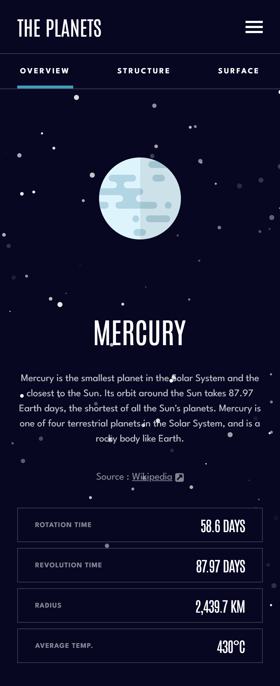
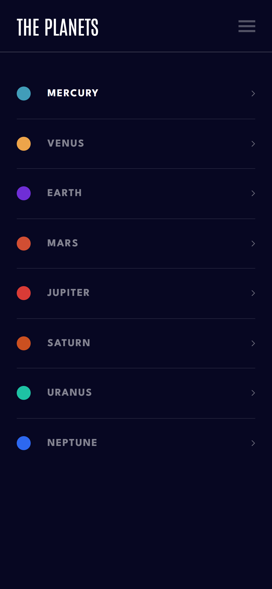
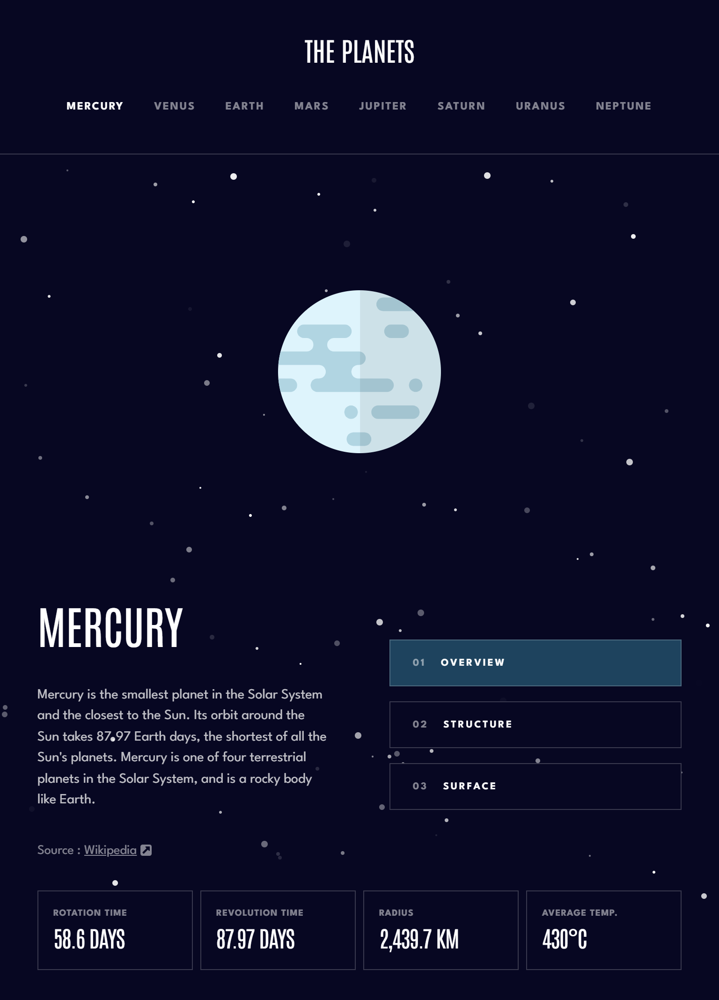
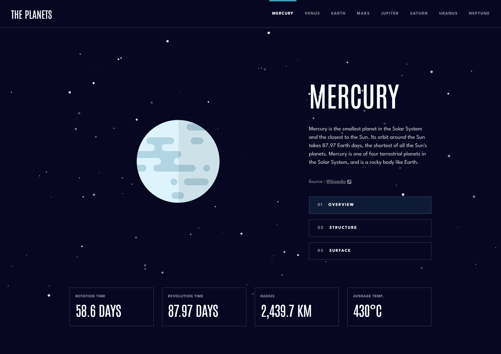

# Frontend Mentor - Dictionary web app solution

This is a solution to the [Planets fact site challenge on Frontend Mentor](https://www.frontendmentor.io/challenges/planets-fact-site-gazqN8w_f). Frontend Mentor challenges help you improve your coding skills by building realistic projects.

## Table of contents

- [Overview](#overview)
  - [The challenge](#the-challenge)
  - [Screenshot](#screenshot)
  - [Links](#links)
- [My process](#my-process)
  - [Built with](#built-with)
  - [What I learned](#what-i-learned)
  - [Useful resources](#useful-resources)
- [Author](#author)
- [Contribution](#contribution)

## Overview

### The challenge

Users should be able to:

- View the optimal layout for the app depending on their device's screen size
- See hover states for all interactive elements on the page
- View each planet page and toggle between "Overview", "Internal Structure", and "Surface Geology"

Bonus:

- Animated texts & planets on first load and page transitions
- Animated background with pulsating stars & shooting stars

### Screenshot

- Mobile (390px)



- Mobile (Navigation) (390px)



- Tablet (768px)



- Desktop (1440px)



### Links

- [Solution URL](https://www.frontendmentor.io/solutions/dictionary-web-app-react-typescript-AM_r8OGGxI)
- [Live Site URL](https://dictionary-web-app-acdev.vercel.app/)

## My process

### Built with

- Semantic HTML5 markup
- CSS custom properties
- Flexbox / Grid
- Mobile-first workflow
- [Typescript](https://www.typescriptlang.org/)
- [React](https://react.dev/)
- [PostCSS](https://ariakit.org/)
- [Animejs](https://ariakit.org/)

### What I learned

#### AriaKit

Really awesome unstyled component library to simplify accessibility

#### Custom Hooks

It was always a very enjoyable part of React since hooks were introduced.
This time i used it to handle the localstorage logic of the app.
Here is the code:

```ts
const LOCAL_PREFIX = 'dictionary-web-app';

const useLocalStorage = <T>(key: string, initialValue: T) => {
  const localKey = `${LOCAL_PREFIX}.${key}`;
  const [value, setValue] = React.useState<T>(() => {
    try {
      const localValue = window.localStorage.getItem(localKey);
      return localValue ? JSON.parse(localValue) : initialValue;
    } catch (err) {
      console.log(err);
      return initialValue;
    }
  });

  React.useEffect(() => {
    window.localStorage.setItem(localKey, JSON.stringify(value));
  }, [localKey, value]);

  return [value, setValue] as const;
};
```

### Useful resources

- [AriaKit Components](https://ariakit.org/components) - Build accessible web apps with React.

## Author

- Frontend Mentor - [@AntoineC-dev](https://www.frontendmentor.io/profile/AntoineC-dev)

## Contribution

You can use this project for whatever you want. Don't forget to leave a ⭐.

- Fork the project to add it to your githug repositories.
- Clone it on your local machine from you repositories.
- Install all the dependencies by running `npm install` or `yarn` or `pnpm` from a terminal located in the project.
- Open the project in your editor and start coding.
